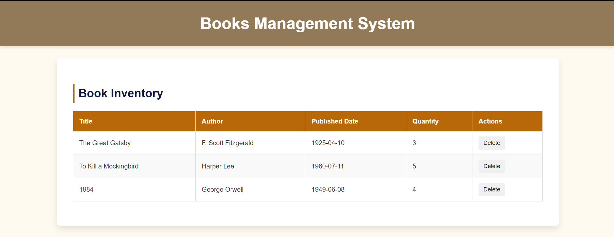

# 📚 Library Management System

A simple and intuitive web application to manage a library's book inventory. This project allows users to add, update, and delete books while maintaining information about authors and book quantities in a MySQL database.

---

## 🛠 Features

- **View All Books**: Displays a list of all books along with their authors, published dates, and available quantities.
- **Add Books**: Add new books to the library. If the author doesn't exist, the system will automatically add the author to the database.
- **Update Book Quantities**: Modify the available quantity of a specific book.
- **Delete Books**: Remove books from the database by their ID.

---

## 🏗️ Tech Stack

### Frontend:

- HTML5
- CSS3
- JavaScript (Vanilla)

### Backend:

- Node.js with Express.js
- MySQL Database

---

## 🚀 Getting Started

### Prerequisites

- Node.js installed on your system
- MySQL database set up

### Installation

1. Clone the repository:
   ```bash
   git clone https://github.com/bPavan16/books-management-app.git
   cd books-management-app
   ```

2. Install the required dependencies:
```bash
npm install
```

3. Set up the MySQL database:
* Create a MySQL database (e.g., library).
* Run the following SQL script to create the tables:

```sql
CREATE TABLE authors (
    id INT AUTO_INCREMENT PRIMARY KEY,
    name VARCHAR(255) NOT NULL,
    bio TEXT
);

CREATE TABLE books (
    id INT AUTO_INCREMENT PRIMARY KEY,
    title VARCHAR(255) NOT NULL,
    author_id INT NOT NULL,
    published_date DATE,
    quantity INT,
    FOREIGN KEY (author_id) REFERENCES authors(id)
);
```

4. Configure the database connection:

* Open the server.js file and update the database configuration:

```javascript
const db = mysql.createConnection({
    host: 'localhost',
    user: 'your-username',
    password: 'your-password',
    database: 'library',
});
```

5. Start the server
```bash
npm run start
```

## 📸 Screenshots

### 📋 Book List Table


### ➕ Add Book Form


### ➕ Update Book Form

