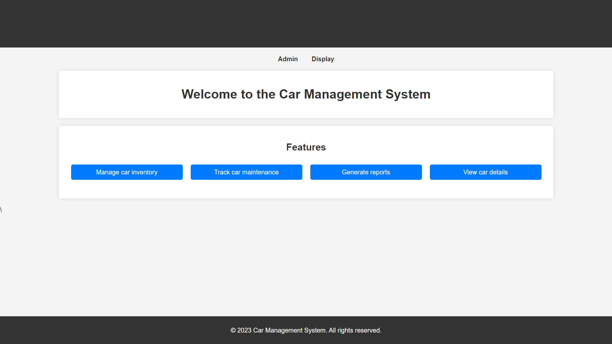
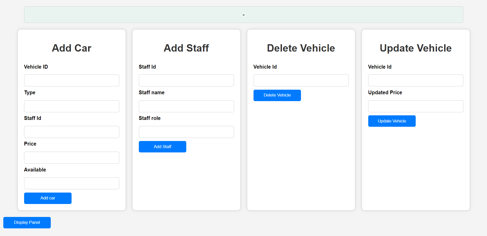
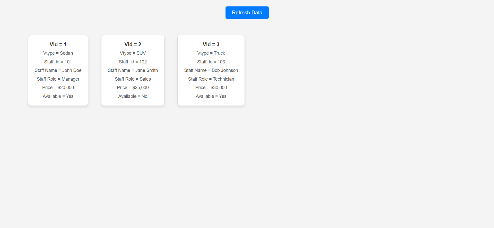

# Car Management System

This project is a simple web application for managing cars and staff in a database. It allows users to perform CRUD operations, including adding cars, adding staff, deleting vehicles, updating vehicle prices, and displaying car and staff data.

This project was created as part of the 2nd evaluation for the Web Technologies subject. It demonstrates a web-based Car Management System that performs CRUD operations using Node.js, Express.js, and MySQL.

## Prerequisites

Before running this project, ensure you have the following installed on your system:

1. **Node.js** (version 12 or higher)
2. **MySQL** (database server)
3. **npm** (Node Package Manager)

## Getting Started

### 1. Clone the Repository
```bash
git clone <repository-url>
cd <repository-directory>
```

### 2. Install Dependencies
Install the required Node.js dependencies using npm:
```bash
npm install
```

### 3. Set Up MySQL Database
Create a MySQL database named `car_db`. Execute the following SQL script to create the necessary tables:
```sql
CREATE TABLE staff (
    staff_id INT PRIMARY KEY,
    staff_name VARCHAR(255),
    staff_role VARCHAR(255)
);

CREATE TABLE vehicle (
    vehicle_id INT PRIMARY KEY,
    vehicle_type VARCHAR(255),
    staff_id INT,
    price FLOAT,
    availability BOOLEAN,
    FOREIGN KEY (staff_id) REFERENCES staff(staff_id)
);
```

### 4. Update Database Credentials
Edit the database connection in the `index.js` file:

```javascript
const db = mysql.createConnection({
    host: 'localhost',
    user: 'root',
    password: '',
    database: 'car_db'
});
```
Replace `host`, `user`, `password`, and `database` with your MySQL credentials.

### 5. Run the Server
Start the Express server:

```bash
node index.js
```
The server will run at [http://localhost:3000](http://localhost:3000).

## API Endpoints

1. **Home Page**
   - **Route:** `/home`
   - **Method:** `GET`
   - **Description:** Serves the homepage.

2. **Add Car Page**
   - **Route:** `/car`
   - **Method:** `GET`
   - **Description:** Serves the add car page.

3. **Display Page**
   - **Route:** `/display`
   - **Method:** `GET`
   - **Description:** Serves the display page.

4. **Add Car**
   - **Route:** `/addCar`
   - **Method:** `POST`
   - **Description:** Adds a car to the database.
   - **Payload:**
     ```json
     {
         "vehicle_id": 1,
         "vehicle_type": "Sedan",
         "staff_id": 101,
         "price": 50000,
         "availability": true
     }
     ```

5. **Add Staff**
   - **Route:** `/addStaff`
   - **Method:** `POST`
   - **Description:** Adds a staff member to the database.
   - **Payload:**
     ```json
     {
         "staff_id": 101,
         "staff_name": "John Doe",
         "staff_role": "Manager"
     }
     ```

6. **Delete Vehicle**
   - **Route:** `/deleteVehicle`
   - **Method:** `POST`
   - **Description:** Deletes a vehicle by its ID.
   - **Payload:**
     ```json
     {
         "vehicle_id": 1
     }
     ```

7. **Update Vehicle Price**
   - **Route:** `/updatePrice`
   - **Method:** `POST`
   - **Description:** Updates the price of a vehicle by its ID.
   - **Payload:**
     ```json
     {
         "price": 60000,
         "vehicle_id": 1
     }
     ```

8. **Get Cars**
   - **Route:** `/getCars`
   - **Method:** `POST`
   - **Description:** Retrieves all cars along with their associated staff details.

## Running the Frontend

Place the `homepage.html`, `addCar.html`, and `displayPage.html` in the same directory as the `index.js` file. These files will be served through the API.

Example Workflow
1. Open http://localhost:3000/home in your browser to access the homepage.
2. Add staff and cars using the respective endpoints or pages.
3. Display cars and their associated staff.

## Screenshots

Here are some screenshots of the Car Management System in action:

### Homepage


### Admin Panel


### Display Page

